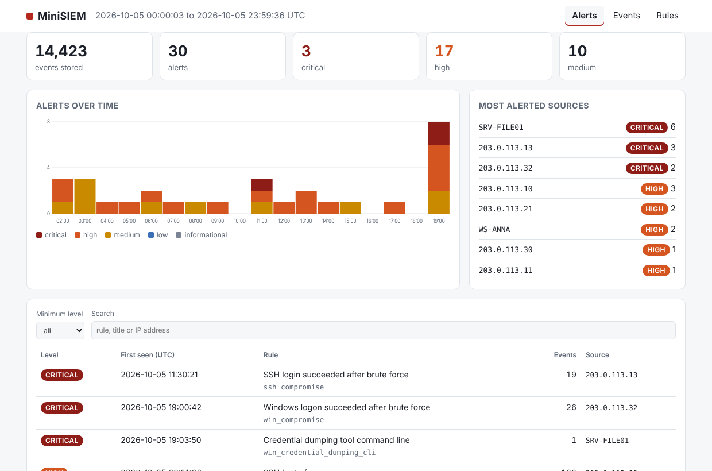
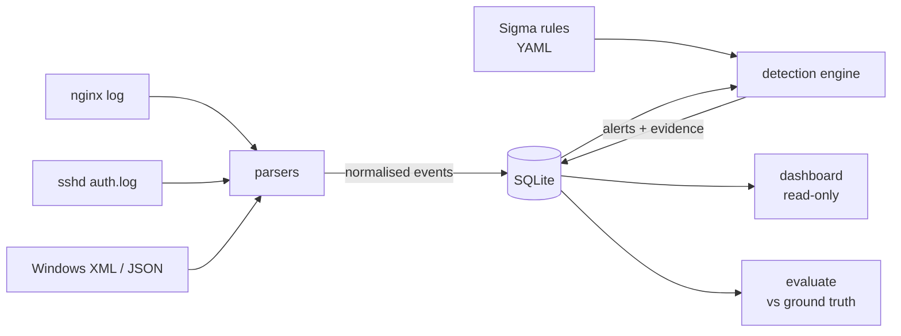

# MiniSIEM

[](https://github.com/HossamAlzohbi/mini-siem/actions/workflows/ci.yml)

A small SIEM you can read in an afternoon. It ingests **nginx**, **SSH** and **Windows event** logs, normalises them,
runs **Sigma-format detection rules** (including **correlation rules**), stores alerts in SQLite and shows them in a
local **dashboard**. Pure Python, one runtime dependency (PyYAML), no external services.



This project was built with AI support.

It was built to learn and to demonstrate *detection engineering*: how raw logs turn into trustworthy alerts, and what the
trade-offs between sensitivity and false positives look like in practice.

**What it is not:** a replacement for Wazuh, Elastic Security or Splunk. It has no agents, no real-time streaming and is
sized for megabytes to a few gigabytes of logs. See [Known gaps](#known-gaps) before trusting it with anything real.

## Quick start

```bash
git clone https://github.com/HossamAlzohbi/mini-siem && cd mini-siem
python -m venv .venv && source .venv/bin/activate      # Windows: .venv\Scripts\activate
pip install -e .
minisiem demo --serve                                    # then open http://127.0.0.1:8765
```

`demo` generates synthetic logs with 15 injected attack scenarios, ingests them, runs all rules, prints a scorecard and
starts the dashboard. Everything is inert text in local files: nothing is sent anywhere.

Run commands from the repository root (that is where the `rules/` directory is found; use `--rules DIR` to point elsewhere).

### On your own logs

```bash
minisiem ingest --type nginx   /var/log/nginx/access.log
minisiem ingest --type ssh     /var/log/auth.log --year 2026 --tz +02:00   # syslog lines carry no year / zone
minisiem ingest --type windows exported_events.xml                          # or Winlogbeat-style .jsonl
minisiem detect                      # rebuilds alerts from all stored events
minisiem alerts --min-level high
minisiem serve                       # dashboard on 127.0.0.1:8765
```

Ingest is idempotent: re-reading the same file does not duplicate events.
Windows input is *exported* events (Event Viewer "Save as XML", or JSON lines); `.evtx` binaries are not parsed.

## How it works



1. **Parse** each source into events with Sigma-style field names (`c-ip`, `cs-uri-query`, `EventID`, `TargetUserName`, ...).
2. **Match** plain rules per event. Rules that are only building blocks (e.g. "failed SSH login") stay silent.
3. **Correlate**: `event_count` (5 failures in a minute), `value_count` (one IP, 5 different usernames),
   `temporal` / `temporal_ordered` (brute force *followed by* a successful login), with `group-by` and field `aliases`
   so SSH and web events can be joined on the same address. Correlations can build on other correlations.
4. **Alert**: bursts are merged, so a 300-request scan is one alert with 300 pieces of evidence, not 300 alerts.

## What it detects

30 rules, each mapped to MITRE ATT&CK. Full catalogue with false-positive notes: [docs/RULES.md](docs/RULES.md).

| Area | Examples |
|---|---|
| SSH | brute force, slow brute force, password spraying, success after brute force (compromise), root login |
| Web | SQL injection, XSS, path traversal, Log4Shell strings, scanner user agents, 404 floods, probing for `/.env` and admin panels, login brute force |
| Windows | brute force / spraying / compromise, new user, user added to Administrators, log cleared, new service, encoded PowerShell, Office spawning a shell, credential-dumping command lines |

## Sigma support

Implemented: selections (maps, lists of maps, keyword lists), `condition` with `and` / `or` / `not` / parentheses /
`1 of` / `all of` / `them` / wildcards; modifiers `contains`, `startswith`, `endswith`, `all`, `re`, `cidr`, `exists`,
`lt`/`lte`/`gt`/`gte`; the correlation types above with `gt` / `gte` / `eq`.

Not implemented, and **rejected with an error at load time** rather than silently never matching: `| count()`
aggregations, `base64` / `windash` modifiers, field-mapping pipelines, `lt`/`lte` correlation conditions.
This engine has not yet been run against the SigmaHQ rule corpus, so do not assume arbitrary community rules work
without checking their field names against the normalised fields.

## Evaluation: what the numbers do and do not say

`minisiem demo` scores the rules against a ground-truth file written by the simulator:

```
Detected 28/28 expected detections (100%)
Total alerts: 30 | extra alerts on attacker traffic: 2 | false positives: 0 (on ~13,500 benign events)
```

Over 30 random seeds the result was the same every time, and benign-only traffic produced no alerts.
Per-scenario detection times are in [docs/EVALUATION.md](docs/EVALUATION.md).

**Read this number sceptically.** The same person wrote the rules and the simulator, the attacks are textbook, and the
benign traffic is far cleaner than a real internet-facing server (which sees constant background scanning). It proves the
pipeline works end to end and that thresholds behave as designed. It does *not* measure how well the rules would do on
your logs. The meaningful next step is to run it on real logs and tune. A guard test makes sure the scorecard can
also say "no": it deletes one rule and checks that exactly that miss is reported.

## Known gaps

Pinned down by tests in [`tests/test_known_gaps.py`](tests/test_known_gaps.py), which pass *because the attack is missed*:

- **Double-encoded and comment-obfuscated SQL injection** (`%2520union%2520select`, `UNION/**/SELECT`). Query strings are decoded once.
- **Distributed brute force** (one guess from each of many addresses) is invisible to per-address thresholds.
- **Very slow brute force** below 20 failures per hour per address.
- **Renamed or unlisted credential-dumping tools**: command-line rules match known strings only.
- Access logs contain no request bodies, so POST-body attacks cannot be seen. Attackers who delete logs before ingestion cannot be seen either.
- Thresholds (8 failures in 5 minutes, ...) are reasonable defaults, not tuned values. Several users behind one NAT address can trigger them.
- Windows group names are localised ("Administrators" / "Administratorer"); extend the list for your environment.
- Syslog timestamps have no year or time zone: you must pass `--year` and `--tz` or events are placed wrongly in time.

## Security of the tool itself

Logs are attacker-controlled input, so the dashboard is built defensively and this is tested, including in a real browser:
log text is only ever inserted with `textContent` (a malicious User-Agent such as `<script>` is shown as text and never
runs), a strict Content-Security-Policy is set, the database is opened read-only, only GET is served, static paths are
confined to the `static/` folder, and the `Host` header is validated against DNS rebinding.
It binds to `127.0.0.1` by default and has **no authentication**: do not expose it to a network without a reverse proxy
that adds it.

## Project layout

```
src/minisiem/
  parsers/        nginx.py  ssh.py  windows.py        raw lines -> Event
  sigma.py        rule loader, field matching, condition parser
  engine.py       correlation, burst merging, alert generation
  store.py        SQLite storage (events, alerts)
  simulate.py     synthetic logs + ground truth        evaluate.py   scoring
  dashboard.py    read-only HTTP API + static/ (HTML, CSS, JS, no CDN)
  cli.py          the `minisiem` command
rules/            30 Sigma-format rules (ssh/, web/, windows/)
tests/            parsers, rule engine, correlation, pipeline, dashboard security, known gaps
docs/             RULES.md  EVALUATION.md  screenshots/
```

## Development

```bash
pip install -e ".[dev]"
pytest -q                 # 70 tests; the browser test runs when Playwright + Chromium are available
minisiem rules validate
python scripts/gen_rules_doc.py
```

Tested locally on Python 3.11, 3.12 and 3.13. CI (GitHub Actions) runs the same matrix.

## Roadmap

- Run the SigmaHQ web, Linux auth and Windows security rules and document which work out of the box
- Real-world tuning: run on actual logs, record false positives per rule, adjust thresholds
- `.evtx` parsing, Linux journald input, Apache error logs
- Optional LLM-assisted alert triage (explain an alert and suggest next steps), running locally
- Allow-lists / suppression per rule so known-good addresses can be excluded without editing rules

## Responsible use

The simulator only writes inert text to local files and sends nothing over any network. Run this tool on logs you are
allowed to analyse. The attack strings in the rules and tests (for example `sekurlsa::` or `${jndi:`) are detection
signatures, not exploits.

## License

MIT
